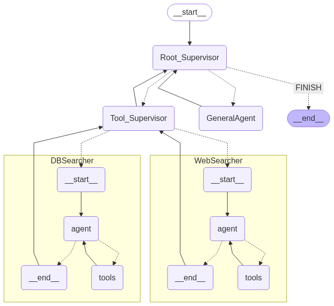
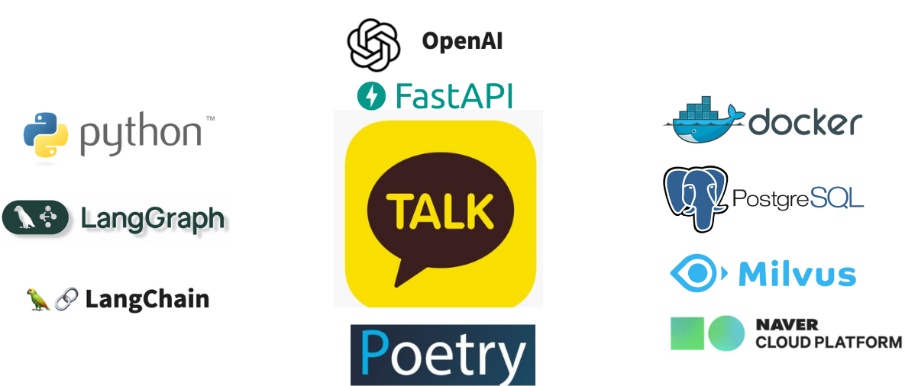

# **파동이봇 카카오톡**


  
  
  
  
## **1. 개요**
파동이봇은 카카오톡을 통해 원내 구성원들이 언제 어디서나 한국원자력연구원 관련 규정 문서를 검색하고, 원자력 지식에 대한 질문을 손쉽게 할 수 있도록 설계되었습니다.  
내부 보안 관련 규정을 제외한 규정만 답변을 제공하며, 외부 사용자도 궁금한 점을 쉽게 질문할 수 있습니다.  
이 챗봇은 KAERI와 관련된 정보에 대한 다양한 질문에 답변합니다.

## **2. 목차**
1. [주요 기능](#3-주요-기능)
2. [전체 동작 구성](#4-전체-동작-구성)
3. [프로젝트 구조](#5-프로젝트-구조)
4. [개발 도구](#6-개발-도구)
5. [설치 방법](#7-설치-방법)
6. [환경 설정](#8-환경-설정)
<<<<<<< HEAD
=======
7. [라이선스](#9-라이선스)
8. [기여·문의](#10-기여문의)
>>>>>>> d07cd9d5cc42f6ab5ec5a129d1664c78281f5340

## **3. 주요 기능**
- **LangGraph 기반 멀티에이전트 오케스트레이션**
  - 사용자의 질문을 분석하여, 해당 질문의 최적의 'agent/tool'을 자동으로 선택하여 조합해 답변을 제공합니다.
  - 다양한 도구(RAG 검색, 웹 검색, 이미지 분석 등)과 LLM 기반 에이전트가 그래프 구조로 이루어 협력하도록 설계되어 있습니다.




- **에이전트 자동 워크플로우**
  - KAERI 관련 질문 : RAG/벡터DB + LLM 에이전트
  - 일반적 지식·실시간 정보 관련 질문 : 웹검색 에이전트
  - 이미지가 포함된 질문 :  이미지 분석 에이전트
  - 단순 대화/잡담 : 파동이(일반 대화) 에이전트
  -> 질문 유형에 따라 자동 분배 및 처리

- **문맥 유지 멀티턴 대화**
  - LangGraph의 상태관리 기능으로 사용자의 질문/응답을 기억하여 자연스럽고 일관된 대화를 지원합니다.

- **카카오톡 챗봇 연동**
  - FASTAPI를 이용하여 카카오톡 플랫폼과 실시간으로 통신합니다.

## **4. 전체 동작 구성**

  1. **질문 입력 (텍스트/이미지 지원)**
  2. **질문 자동 분류:**  
    질문의 주제/목적에 따라 아래 중 한 에이전트로 라우팅
    - DB(내부 RAG) 검색 에이전트
    - 웹 검색 에이전트
    - 이미지 분석 에이전트
    - 파동이(일반 대화) 에이전트
  3. **각 에이전트 결과 취합**  
    (필요시 복수툴 연쇄적 호출도 자동실행)
  4. **최종 답변 생성**:  
    컨텍스트(이전 대화, 참고 자료 등)를 반영해서 자연스럽고 친근한 답변 제공
  5. **카카오톡 및 외부 API로 실시간 답변 전송**
  6. **모든 대화 이력/참고자료 DB 기록**


## **5. 프로젝트 구조**
```
├── admin/                     # 관리 관련 스크립트 및 설정
├── config.py                  # 기본 설정 파일
├── database/                  # 데이터베이스 관련 코드 및 데이터
│   ├── orm.py
│   ├── redis                # 데이터베이스 모델 정의
│   ├── save_answer.py             # 데이터베이스 연결 설정
│   └── user_queries.csv
├── dependencies.py            # 의존성 관리
├── docker-compose.yml         # Docker Compose 설정 파일
├── Dockerfile                 # Docker 이미지 설정 파일
├── init
│   └── init.sql                        # 초기화 스크립트
├── main.py                    # 메인 애플리케이션 실행 파일
├── models.py
├── padong_backup.sql          # 데이터베이스 백업 파일
├── poetry.lock                # Python 종속성 잠금 파일
├── pyproject.toml             # Python 프로젝트 설정 파일
├── routers/                   # FASTAPI로 통신
│   ├── __init__.py
│   ├── dashboard.py
│   ├── faq.py 
│   ├── vectordb.py  
│   ├── kakao.py               # kakao 통신
│   ├── langgraph_router.py    # Langgraph 질문 분류 multiagent 파일
│   └── settings.py  
├── services/                  # 응답 서비스
│   ├── __init__.py
│   ├── LGanswer_generator.py  # LangGraph 기반 답변 생성 함수 파일
│   ├── tools.py               # 특화 도구 기능 폴더
│       ├── api_tool.py        # KAERI 내부 규정/지침 문서 RAG(벡터DB) 검색 에이전트 도구
│       ├── realtime_tool.py   # 날짜/시간 등 실시간 정보 제공 도구
│       ├── web_tool.py        # 외부 웹검색 및 실시간 정보 요약 도구
│       ├── vector_tool.py     # milvus vectordb 검색하여 정보 제공 도구
│   ├── prompt.txt 
│   └──vector_store.py
├── utils/                     # log 기록
│   ├── logger.py
├── view_user_queries.py       # 사용자 쿼리 시각화
└── .gitignore                 # Git 추적 제외 목록
```


## **6. 개발 도구**
- [FASTAPI](https://fastapi.tiangolo.com/)
- [OPENAI](https://platform.openai.com/)
- [NCLOUD](https://www.ncloud.com/)
- [LangChain](https://python.langchain.com/)
- [LangGraph](https://langchain-ai.github.io/langgraph/)
- [Milvus (벡터 DB)](https://milvus.io/)
- [PostgreSQL (데이터베이스)](https://www.postgresql.org/)
- [Docker (컨테이너)](https://www.docker.com/)
- [Python](https://www.python.org/)
- [Poetry (패키지 관리)](https://python-poetry.org/)
- [카카오톡 비즈니스 계정](https://business.kakao.com/info/kakaotalkchannel/)  




## **7. 설치 방법**

### 1. 서버 접속

```
<<<<<<< HEAD
1. navercloudserver의 .pem 키 파일을 다운받습니다.  
2. 발급 받은 키로 서버 접속:  
   1. ssh -i [keyname].pem ncloud@서버주소 -p [포트번호]
=======
1. padong-bot.pem 키 파일을 다운받습니다.  
2. 발급 받은 키로 서버 접속:  
   1. ssh -i padong-bot.pem ncloud@211.188.39.133 -p 3333
>>>>>>> d07cd9d5cc42f6ab5ec5a129d1664c78281f5340
   2. (필요시) 비밀번호 입력
```

### 2. 서버 배포
```
# 1. 도커 설치
sudo apt update
sudo apt install docker.io -y

# 2. docker-compose 설치
sudo curl -L "https://github.com/docker/compose/releases/download/1.29.2/docker-compose-$(uname -s)-$(uname -m)" -o /usr/local/bin/docker-compose
sudo chmod +x /usr/local/bin/docker-compose

# 3. 프로젝트 파일 전체를 서버로 옮깁니다

# 4. 도커파일 빌드 및 애플리케이션 실행
cd admin
docker build -t kaeri-admin .

cd ..
docker build -t fastapi .
docker-compose up --build

```

### 3. 파일만 다운일 때
```
poetry install
cp .env.example .env      # 환경변수 셋업
poetry run uvicorn main:app --reload
```


## **8. 환경 설정**

```
.env.example 파일을 참고해서 .env 파일을 만들어주세요.
Python 3.11 이상 사용


패키지(의존성) 관리 : Poetry 사용
- 'pyproject.toml'에는 프로젝트의 패키지 목록, 설정 정보가 담겨있습니다.
- 'poetry.lock'에는 실제 설치된 패키지 버전 정보가 기록되어 있습니다.

```

<<<<<<< HEAD
=======
## **9. 라이선스**


## **10. 기여·문의**
- 문의:  
    ygyu@kaeri.re.kr   
    qhwjd8447@kaeri.re.kr  
    jya0090@kaeri.re.kr  
    gksrlgjs0767@kaeri.re.kr  
>>>>>>> d07cd9d5cc42f6ab5ec5a129d1664c78281f5340
